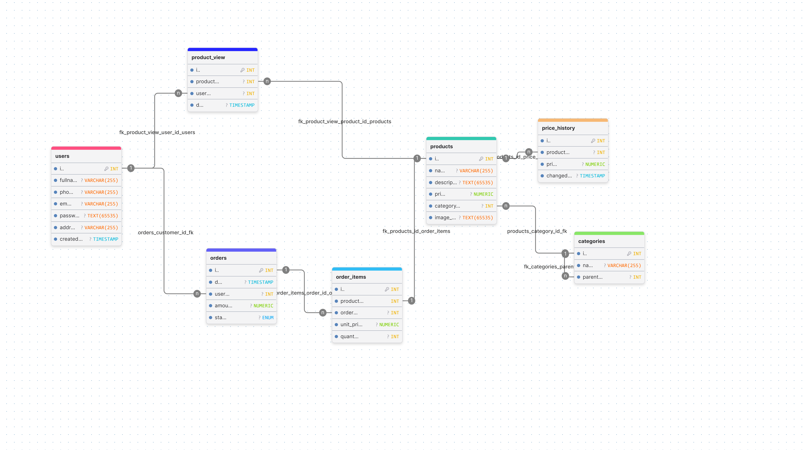

# **E-commerce Analytics Dashboard**

This is a analytics dashboard simulating real-time e-commerce activity

---

## What this project does:

The system simulates an online store and shows basic analytics such as:

- total revenue
- number of orders
- products sold
- top products
- product views


There is also analytics for all time/30 last days and it is generated automatically to simulate real activity in real time

---

## How to run the project

The easiest way to run everything is with Docker:

```
docker compose up --build
```

Then open:


- Frontend: [localhost:3000](http://localhost:3000)

- Backend: [localhost:8080](http://localhost:8080)

---
## Architecture


### *Backend (GO)*

- REST API server
- connects to PostgreSQL
- serves analytics data
- runs background worker to generate fake activity


### *Database (PostgreSQL)*

- stores users, orders, products, and analytics data
- uses materialized views for fast analytics queries

### *Frontend*

- simple dashboard UI
- fetches data from backend API
- displays charts and cards

## Database Schema:


---
## How data works

A background worker generates fake activity every few seconds:

- new orders are created
- order items are added
- product views are generated

Materialized views are refreshed periodically to update analytics

---

## Performance & Indexes (EXPLAIN ANALYZE)

The database uses indexes to speed up frequent queries
We verified performance using `EXPLAIN ANALYZE`


#### 1. Orders by user

```sql
EXPLAIN ANALYZE
SELECT * FROM orders WHERE user_id = 5;
```

```
Seq Scan on orders (cost=0.00..7.20 rows=33 width=25)
                   (actual time=0.011..0.022 rows=19 loops=1)
Filter: (user_id = 5)
Rows Removed by Filter: 139
Planning Time: 0.067 ms
Execution Time: 0.034 ms
```
PostgreSQL chose Seq Scan over index scan due to small dataset size
Index `idx_orders_user_id` would activate on larger datasets (10k+ rows)

#### 2. Orders by date range

```sql
EXPLAIN ANALYZE
SELECT * FROM orders
WHERE created_at >= NOW() - INTERVAL '30 days';
```

```
Seq Scan on orders (cost=0.00..8.88 rows=336 width=25)
                   (actual time=0.006..0.039 rows=172 loops=1)
  Filter: (created_at >= (now() - '30 days'::interval))
Planning Time: 0.166 ms
Execution Time: 0.053 ms
```

Seq Scan due to small dataset. Index `idx_orders_created_at` activates on larger datasets

---

#### 3. Products by category

```sql
EXPLAIN ANALYZE
SELECT * FROM products WHERE category_id = 2;
```

```
Index Scan using idx_products_category_id on products
      (cost=0.14..8.16 rows=1 width=604) (actual time=0.014..0.017 rows=9 loops=1)
  Index Cond: (category_id = 2)
Planning Time: 0.062 ms
Execution Time: 0.031 ms
```

Index scan used — PostgreSQL chose the index because category_id is selective

---

#### 4. Order items by order

```sql
EXPLAIN ANALYZE
SELECT * FROM order_items WHERE order_id = 10;
```

```
Seq Scan on order_items (cost=0.00..5.71 rows=1 width=21)
                        (actual time=0.007..0.020 rows=1 loops=1)
  Filter: (order_id = 10)
  Rows Removed by Filter: 244
Planning Time: 0.195 ms
Execution Time: 0.031 ms
```

 Seq Scan due to small dataset. Index `idx_order_items_order_id` activates on larger datasets

---

## API endpoints

> GET /analytics/revenue - revenue + orders summary
> GET /analytics/top-products - most sold products
> GET /analytics/productview - product views analytics
> GET /analytics/orders-summary - total order stats


---

## Tech Stack

| Technology | Version | Purpose |
|---|---|---|
| Go | 1.23.4 | REST API, background worker |
| PostgreSQL | 16 | Database |
| Docker | 29.5.3 | Containerization |


---
## Notes

This project is not production-ready.
It is mainly built for learning purposes:

- SQL practice
- backend architecture understanding
- data aggregation concepts
- simple dashboard visualization